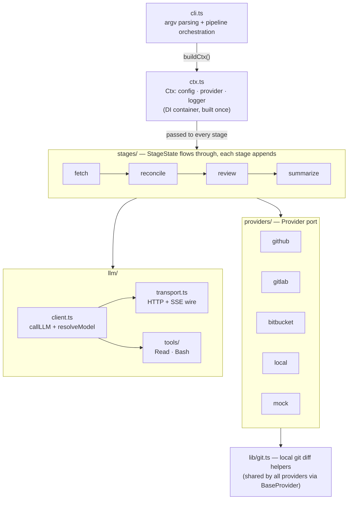
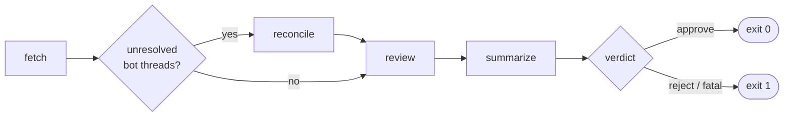

# Architecture

LLM-driven pull-request reviewer. One binary (`reviewer`), four pipeline stages, pluggable
VCS destinations, any OpenAI-compatible LLM endpoint. Designed to run as a CI gate: the
process exit code *is* the verdict.

This document is the map: structure as it is and the patterns the codebase commits to.
Portable engineering rules live in [docs/conventions/](conventions/); dated decisions
(and their trade-offs) in [docs/adr/](adr/).

---

## 1. System overview



Two external worlds, each behind one port:

- **VCS** (`providers/types.ts` → `Provider`) — where the PR lives and where findings are
  posted. Five adapters: GitHub, GitLab, Bitbucket, `local://` (console echo), `mock://`
  (test recorder).
- **LLM** (`llm/`) — any OpenAI-compatible `/chat/completions` endpoint, streamed, with a
  local tool loop (`Read`, `Bash`) and schema-validated JSON output.

Everything else is orchestration around a single state object.

## 2. Runtime flow (`reviewer run`)



1. `parseArgs` → `buildCtx` — config is loaded (env + CLI overrides), the provider is
   chosen from the PR URL shape, the model is auto-detected from `GET /models` if unset.
2. **fetch** — PR metadata, comments, changed files; classifies each changed file into a
   rendering strategy (`full_file` / `big_file` / binary bucket); loads project standards
   and checklist. Pure setup: no LLM, no writes to the PR.
3. **reconcile** (only when unresolved bot threads exist) — deterministic passes first
   (rename relocation, auto-address on deleted files), then one LLM call judging the
   surviving threads. Resolves threads it deems addressed.
4. **review** — one LLM call with the diff + rendering context + tools; anchors each
   finding's verbatim snippet to a head-side line locally; posts inline comments.
5. **summarize** — derives the verdict from accumulated state (no LLM), deletes stale
   bot summaries, posts the new summary, calls `approve()`/`reject()` on the provider.
   `verdict.fatal` drives `process.exit(1)`.

Every stage is independently addressable as a subcommand (each re-runs fetch first).

## 3. Module map

| Path | Role |
| --- | --- |
| `src/cli.ts` | argv parsing, command → stage-sequence dispatch, exit code |
| `src/ctx.ts` | `Config` shape, `loadConfig` (the **only** `process.env` reader), provider dispatch, `buildCtx` |
| `src/stages/types.ts` | `StageState` and everything inside it — the pipeline's shared vocabulary |
| `src/stages/shared.ts` | helpers shared by LLM-using stages (prompt assets, slots, sections, metrics) |
| `src/stages/<stage>/index.ts` | one `run<Stage>(ctx, state)` function per stage |
| `src/stages/<stage>/prompt.md`, `schema.json` | the stage's LLM contract, colocated |
| `src/providers/types.ts` | `Provider` port + wire types + `detectProvider` URL dispatch |
| `src/providers/<provider>.ts` | one adapter per destination |
| `src/llm/types.ts` | shared LLM contract: wire shapes (`ChatMessage`, `ToolCall`, …) + `Section` / `LLMResult` |
| `src/llm/client.ts` | consumer API: `callLLM` (tool loop, JSON extraction, schema healing) + `resolveModel` |
| `src/llm/transport.ts` | the wire: `send` (HTTP POST), `receive` (SSE accumulator) |
| `src/llm/tools/` | LLM-callable tools, registry + one file per tool |
| `src/lib/` | host-level helpers with no domain knowledge (`git.ts`) |
| `src/logger/` | `Logger` port + console / memory sinks |
| `tests/e2e/` | vitest suites driving real stages against `mock://` fixtures |
| `tests/fixtures/<area>/<scenario>/` | `old/` + `new/` repo pair + `config.yaml` per scenario |

## 4. Core patterns

### 4.1 Ctx — single DI container (ADR-0001)

All dependencies (`config`, `provider`, `logger`) ride in one `Ctx` built once at entry and
passed explicitly to every stage. No globals, no service locator, no module-level
singletons holding state. Tests swap parts by passing overrides into `buildCtx`
(`logger`, `review` config) — never by monkey-patching.

**Corollary — env isolation:** `process.env` is read in exactly one function,
`loadConfig`. Everything downstream consumes the typed `Config`. A new setting means a
new typed field + default, not a scattered `process.env.X` read.

### 4.2 Stage pipeline — uniform `StageState` (ADR-0002)

Every stage has the same signature:

```ts
runX(ctx: Ctx, state: StageState): Promise<StageState>   // fetch takes only ctx
```

Rules the shape encodes:

- Stage outputs are **additive**: each optional field (`decisions`, `findings`,
  `verdict`) is set once by exactly one producing stage.
- Stages return `{ ...state, <their field>, metrics: [...state.metrics, metric] }` —
  spread-and-extend, no in-place mutation of the state object itself.
- Telemetry is uniform: every stage appends one `StageMetric` (duration, tokens, heal
  attempts, tool calls, `skipped`).
- The orchestrator (`cli.ts`) holds the sequencing policy (when reconcile runs); stages
  hold no knowledge of each other.

### 4.3 Provider — port with static async factories (ADR-0003)

One interface, five adapters. Key commitments:

- **One PR per instance.** Identity (owner/repo/number, resolved bot login) is captured
  in `static async create(config)`; methods take no ref parameter.
- **Constructors are private and synchronous; `create()` does the async work** (token →
  bot identity resolution, URL parsing, fixture/repo setup).
- **Semantic outcomes, not mechanics.** `approve()`/`reject()` encapsulate per-platform
  degradation (GitHub bots post a COMMENT review instead of approving; GitLab/Bitbucket
  have no native request-changes). Callers never branch on provider name.
- **Diffs are computed locally.** All providers delegate changed-files/diff/rename work
  to `lib/git.ts` against the checked-out repo (the shared base class in
  `providers/base.ts` carries these methods — ADR-0004); the VCS API supplies only
  metadata, comments, and write operations.
- URL shape → provider is decided in one place: `detectProvider`.

### 4.4 LLM call — tool loop with schema healing (ADR-0005)

`callLLM` is the only way stages talk to the model. Per call:

1. Serialize prompt sections (4.5) into system + user messages.
2. Stream the completion; while the model returns `tool_calls`, execute them locally
   (`llm/tools/`) and feed results back — repeat until final text.
3. Extract JSON (fenced block → whole text → longest-parsing-span salvage), validate
   against the stage's JSON Schema (ajv).
4. On failure, **heal**: append the bad output + a failure-specific instruction and
   retry, up to `healRetries`. Heal prompts distinguish malformed-JSON from
   schema-mismatch — the fix instructions differ.

Tools follow a registry pattern: each tool is `{ schema, execute }` in its own file,
collected in `tools/index.ts`. Tool errors are written *for the model* — explicit about
what was received and what to do next, because weaker models loop on terse errors.

### 4.5 Prompt assembly — colocated assets + tagged slots (ADR-0006)

A stage's LLM contract is two files next to its code: `prompt.md` (instructions) and
`schema.json` (output shape, also embedded into the prompt as `<output_schema>`).
Dynamic data is injected as XML-tagged sections (`<pr_diff>`, `<pr_comments>`,
`<rendering_context>`, …) via the `Section { tag, content }` list; empty sections are
omitted. The prompt names every tag it may receive, so prompt ↔ code stay reviewable
side by side.

### 4.6 Snippet anchoring — LLMs quote, the harness counts (ADR-0007)

Findings never carry line numbers. The model emits a verbatim single-line `snippet`
(plus optional `context_before/after`); `review/index.ts` locates it in the head file
(whitespace-lenient, uniqueness-checked) and converts to a line number. Degradation is
explicit: file gone → top-level comment with a banner; ambiguous → line 1 with a banner.

### 4.7 Logger — port + scoped children (ADR-0008)

Structured, event-named logging (`scope.event` via `child()` chains, snake_case event
names, data as a flat object). Two sinks: `ConsoleLogger` (pretty, stderr) and
`MemoryLogger` (test assertions). The `stream()` channel carries raw LLM tokens so CI
logs show output live; structured sinks may ignore it.

### 4.8 Deterministic-first, LLM-last

Wherever a judgment can be made mechanically, it is — before any model call. Reconcile
auto-addresses threads on deleted files and relocates renamed ones deterministically and
only sends the remainder to the LLM; summarize derives the verdict purely from state;
fetch classifies files by size/coverage heuristics. The LLM is reserved for judgment
that genuinely needs reading code.

### 4.9 Safety gates are environmental, not flags

`local://` review (LLM gets unsandboxed `Bash`/`Read`) requires an actual container,
detected via runtime-created files (`/.dockerenv`, `/run/.containerenv`) — not an env
flag anyone could export. Same idea elsewhere: bot identity is derived from the token
(`GET /user`), not from a CI-shaped env variable.

### 4.10 Test strategy — real stages, mock destination, real git

E2E tests drive real stage functions through `mock://<scenario>` fixtures. The mock
provider builds a **real throwaway git repo** from `old/` + `new/` fixture trees, so
diff/rename behavior is git's own, not a reimplementation. Side effects are recorded on
the mock for assertions. Assertions favor structural guarantees (what got posted, which
bucket a file landed in) over fragile text matching of LLM output. Pure logic
(summarize) is unit-tested with hand-built state — no LLM, no fixture.

## 5. Conventions

The portable rule set (naming, types placement, consolidation, error handling,
configuration, logging, testing, documentation) lives in
[docs/conventions/](conventions/) and is adopted by ADR-0013. Below are only the
**repo-specific** conventions on top of it.


**Language / compiler.** TypeScript, `strict` + `noUncheckedIndexedAccess`, ESM,
Node ≥ 24. Source runs directly via `--experimental-transform-types` (Docker, `pnpm
start`); `dist/` is compiled output committed for npm consumers. Imports use explicit
`.ts` extensions (`rewriteRelativeImportExtensions` handles emit). `import type` for
type-only imports. Node built-ins use the `node:` prefix.

**Naming.** `run<Stage>` for stage entry points; `<Name>Provider` for VCS adapters;
`UPPER_SNAKE` for module-level constants; log events are `dot.scoped` snake_case
(`anchor.unresolved`, `llm.heal`); config fields are camelCase; LLM wire types mirror
the OpenAI JSON (snake_case) and are not renamed.

**Data shapes.** Plain interfaces + functions; classes only where identity/lifecycle
matter (providers, loggers). Wire formats (`PRComment`, `ChangedFile`) are defined once
— in the module that produces them — and re-exported by the port that exposes them
(ADR-0009). Schema/LLM-facing fields are snake_case; internal fields camelCase.
